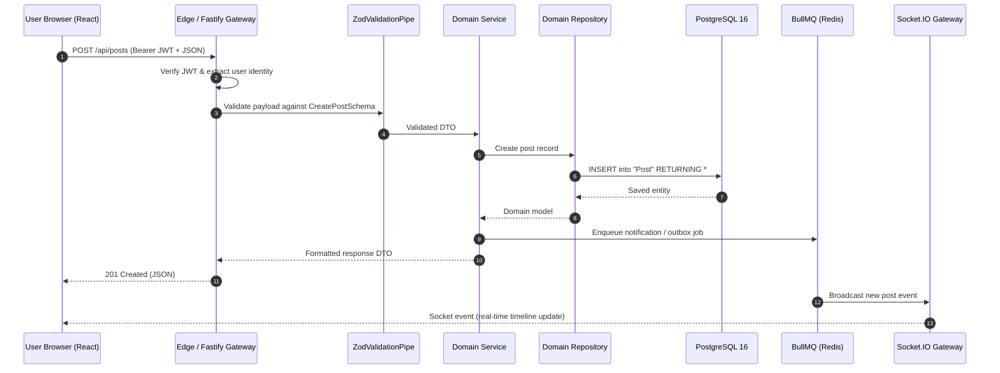

# 🏛️ System Architecture & Monorepo Overview

The **Social Network** platform is a high-performance, real-time web application engineered for scale, privacy, and seamless user interaction. It is organized as a unified monorepo managed with **pnpm workspaces** and **Nx**.

---

## 🗺️ Architecture Documentation Index

| Subsystem              | Scope                                                                | Deep Dive Guide                      |
| :--------------------- | :------------------------------------------------------------------- | :----------------------------------- |
| **Backend Service**    | NestJS 11 + Fastify, 4-tier layering, BullMQ background queues       | [Backend Architecture](backend.md)   |
| **Frontend Client**    | React 19 + Vite 8, Feature-Sliced Design (FSD), TanStack Query       | [Frontend Architecture](frontend.md) |
| **Data Persistence**   | PostgreSQL 16 schema, Prisma ORM 5, Complete ERD diagram             | [Database Schema & ERD](database.md) |
| **Real-time Gateway**  | Socket.IO 4, `/messenger` namespace, Redis pub/sub adapter, presence | [Real-Time Gateway](realtime.md)     |
| **Security & Privacy** | Argon2id, JWT rotation, AES-256-GCM E2EE, Cosign signing             | [Security & Privacy](security.md)    |

---

## 🎯 High-Level Architecture (C4 Model)

```mermaid
graph TB
    subgraph Clients["Clients"]
        Browser["Modern Web Browsers<br/>(Desktop / Mobile)"]
    end

    subgraph Edge["Edge & Ingress"]
        CDN["Cloudflare Anycast CDN<br/>(WAF, DDoS, SSL/TLS, Caching)"]
        VercelEdge["Vercel Edge Network<br/>(React SPA Host)"]
    end

    subgraph Platform["Application Platform"]
        API["Backend API Cluster (NestJS + Fastify)<br/>- REST Endpoints<br/>- Socket.IO Gateway (/messenger)<br/>- Zod Validation<br/>- Passport + JWT"]
        Worker["Background Queue Workers (BullMQ)<br/>- Media Optimization (Sharp)<br/>- Outbox Event Dispatcher<br/>- Scheduled Cleanup Jobs"]
    end

    subgraph Storage["State & Storage Tier"]
        PG[(PostgreSQL 16 Primary)]
        Redis[(Redis 7 Cluster<br/>- Session & Presence Store<br/>- Rate Limit Buckets<br/>- Socket.IO Adapter<br/>- BullMQ Message Broker)]
        S3[(S3 / MinIO Object Storage<br/>- Images, Videos, Avatars, Banners)]
    end

    subgraph Observability["Telemetry & Monitoring"]
        Prom[Prometheus Metrics]
        Grafana[Grafana Dashboards]
        Tempo[Grafana Tempo (OTEL Traces)]
        Loki[Grafana Loki (Structured Logs)]
    end

    Browser -->|HTTPS / Static Assets| VercelEdge
    Browser -->|HTTPS REST API| CDN
    Browser -->|WSS Socket.IO| CDN
    CDN --> API
    API --> PG
    API --> Redis
    API --> S3
    API --> Worker
    Worker --> PG
    Worker --> Redis
    Worker --> S3

    API -.-> Prom
    API -.-> Tempo
    API -.-> Loki
    Prom -.-> Grafana
    Tempo -.-> Grafana
    Loki -.-> Grafana
```

---

## 📦 Monorepo Structure & Workspace Topology

The repository avoids arbitrary `packages/` or `libs/` overhead (see [ADR 002](../adr/002-zero-packages-folder-and-path-aliases.md)) by sharing contracts and schemas directly through TypeScript path mappings and Vite aliases:

```text
social-network/
├── backend/                       # NestJS 11 + Fastify + Prisma 5
│   ├── prisma/                    # PostgreSQL Schema & Migrations
│   │   ├── schema.prisma          # Single source of truth for DB models
│   │   └── migrations/            # Version-controlled SQL migrations
│   └── src/
│       ├── common/
│       │   ├── contracts/         # Zod schemas & shared TypeScript types (@common/contracts)
│       │   ├── prisma/            # PrismaService and repository base (@common/prisma)
│       │   ├── guards/            # JwtAuthGuard, RolesGuard, WsJwtGuard
│       │   └── pipes/             # ZodValidationPipe
│       └── [domain-modules]/      # auth, users, posts, messenger, stories, poll, etc.
│
├── frontend/                      # React 19 + Vite 8 + Tailwind CSS 4
│   └── src/
│       ├── app/                   # App providers, router setup, global styles
│       ├── pages/                 # Route-level views (Feed, Chat, Profile, etc.)
│       ├── widgets/               # Composition widgets (Navbar, PostCard, Sidebar)
│       ├── features/              # User interactions (like-post, send-message, edit-profile)
│       ├── entities/              # Domain entities (user, post, conversation, notification)
│       └── shared/                # UI kit, API clients, helpers, hooks
│
├── docs/                          # Comprehensive system documentation (this repository)
├── infrastructure/                # Terraform modules & AWS OIDC setup
├── monitoring/                    # Prometheus, Grafana, Loki & Tempo configurations
├── scripts/                       # CI/CD, backup, load-testing & verification scripts
├── nx.json                        # Nx workspace task pipeline configuration
├── package.json                   # Root package definition & scripts
└── pnpm-workspace.yaml            # Monorepo member definitions
```

---

## 🛠️ Technology Stack Matrix

| Layer                       | Technology                      | Key Capabilities & Rationale                                                                                                                                                  |
| :-------------------------- | :------------------------------ | :---------------------------------------------------------------------------------------------------------------------------------------------------------------------------- |
| **Backend Engine**          | **NestJS 11 + Fastify**         | High throughput, low overhead, modular dependency injection, Fastify plugins for Helmet, CORS, and Multipart uploads.                                                         |
| **Data Layer**              | **Prisma 5 + PostgreSQL 16**    | Type-safe queries, connection pooling via `@prisma/adapter-pg`, zero-downtime expand/contract schema evolution.                                                               |
| **Contracts & Validation**  | **Zod (`@common/contracts`)**   | Single source of truth shared between backend and frontend without build step; zero runtime reflection overhead (see [ADR 001](../adr/001-monorepo-nx-and-zod-contracts.md)). |
| **In-Memory & Queues**      | **Redis 7 + BullMQ**            | Socket.IO Redis adapter for horizontal scaling, distributed rate-limiting locks, persistent task queues, transactional outbox pattern.                                        |
| **Real-time Gateway**       | **Socket.IO 4**                 | Bi-directional WebSocket communication (`/messenger`), presence heartbeats, typing indicators, end-to-end encryption key sync.                                                |
| **Frontend Framework**      | **React 19 + Vite 8**           | Sub-second HMR via Vite, React Compiler for automatic memoization, Feature-Sliced Design (FSD) architecture.                                                                  |
| **Frontend State**          | **TanStack Query + Zustand**    | TanStack Query for server state caching & optimistic updates; Zustand for lightweight reactive client UI state.                                                               |
| **Styling**                 | **Tailwind CSS 4**              | Modern CSS variables design system, dark mode support, zero runtime CSS overhead.                                                                                             |
| **Observability**           | **OTEL + Prometheus + Grafana** | Unified correlation ID (`x-correlation-id`), distributed traces via Grafana Tempo, metrics exported via `prom-client`.                                                        |
| **Security & Supply Chain** | **Cosign + Argon2 + Helmet**    | Keyless OIDC container signing, Argon2id password hashing, strict CSP and HTTP security headers, CycloneDX SBOM.                                                              |

---

## 🔄 End-to-End Data Flow



---

## 🧭 Architectural Principles

1. **Type-First Contract Sharing**: Backend endpoints and frontend queries share identical Zod schemas. If the API contract changes, compilation breaks instantly on both sides before reaching runtime.
2. **Strict Layering**: Controllers never talk to `PrismaService` directly. All queries pass through `Controller` -> `Service` -> `Repository` -> `PrismaService`.
3. **Optimistic UI with Real-time Confirmation**: Frontend mutations instantly reflect in the UI and reconcile transparently upon server acknowledgment or WebSocket broadcast.
4. **Defense in Depth**: Every layer validates inputs: Edge rate limiting -> Fastify body limits -> Zod payload validation -> Repository ownership checks -> Database relational constraints.
