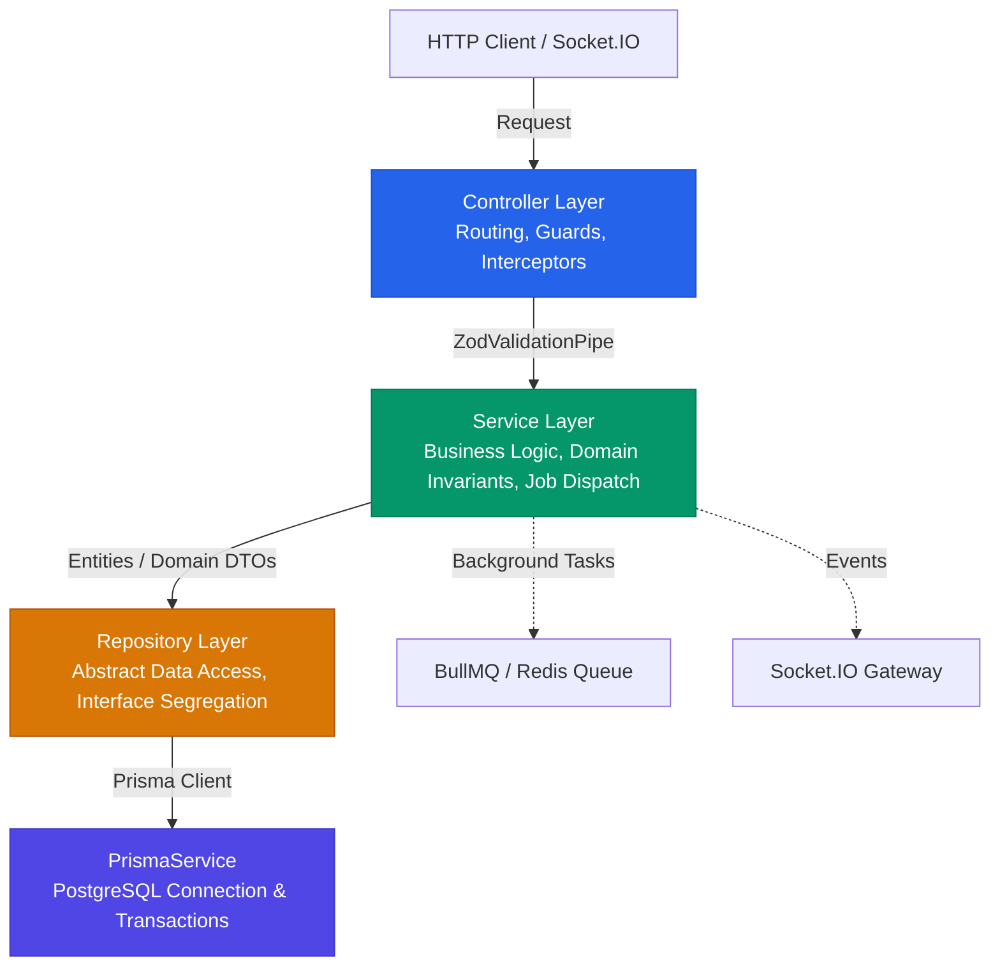
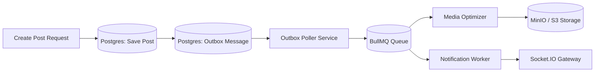

# ⚙️ Backend Architecture (NestJS + Fastify)

The backend service is built on **NestJS 11** utilizing the **Fastify** HTTP adapter (`@nestjs/platform-fastify`), providing ultra-high HTTP throughput, low memory footprint, and native schema compilation.

---

## 🏛️ Layering & Architectural Flow

To maintain testability, separation of concerns, and clean boundaries, the backend strictly enforces a 4-tier layer pattern:



### Strict Layering Rules

> [!IMPORTANT]
>
> - **Controllers and Services MUST NEVER invoke `PrismaService` directly**.
> - Data operations are isolated behind explicit Repository interfaces (e.g., `IPostsRepository`, `IUsersRepository`).
> - This abstraction guarantees that data access can be swapped, decorated with caching, or mocked cleanly during testing without spinning up whole databases.

| Layer             | Responsibility                                                                                                 | What it Can Import                                          | Prohibited                                                     |
| :---------------- | :------------------------------------------------------------------------------------------------------------- | :---------------------------------------------------------- | :------------------------------------------------------------- |
| **Controller**    | Routes, HTTP status codes, decorators (`@UseGuards`, `@UseInterceptors`), Swagger documentation.               | Domain Services, DTO schemas.                               | Direct DB calls, business logic calculations, `PrismaService`. |
| **Service**       | Domain validation, authorization checks, orchestrating repositories, event emission, queuing background tasks. | Repositories, Event Emitters, Queue Service, Redis Service. | Raw SQL/Prisma calls, Fastify `Request`/`Reply` objects.       |
| **Repository**    | Data mapping, relational joins, pagination offsets/cursors, Prisma transaction management.                     | `PrismaService`, database models.                           | HTTP logic, authorization decisions, business workflow.        |
| **PrismaService** | Connection pooling, lifecycle hooks, query logging.                                                            | `@prisma/client`.                                           | Direct controller/service bindings.                            |

---

## 🛡️ Input Validation & Single-Source-of-Truth Contracts

Rather than using decorator-based validation (`class-validator`), which introduces heavy runtime reflection overhead and TypeScript metadata baggage, this project uses **Zod schemas** (see [ADR 001](../adr/001-monorepo-nx-and-zod-contracts.md)).

### Validation Pipeline

1. Contracts are defined in `backend/src/common/contracts/` using Zod.
2. The global `ZodValidationPipe` intercepts incoming request payloads:
   ```typescript
   // Example controller usage
   @Post()
   @UsePipes(new ZodValidationPipe(CreatePostSchema))
   async create(
     @CurrentUser() user: AuthUser,
     @Body() dto: CreatePostDto,
   ): Promise<PostResponseDto> {
     return this.postsService.create(user.id, dto);
   }
   ```
3. If payload validation fails, a structured `400 Bad Request` is returned immediately with detailed field-level issues:
   ```json
   {
     "statusCode": 400,
     "error": "Bad Request",
     "message": "Validation failed",
     "issues": [
       {
         "field": "content",
         "message": "Content must be between 1 and 5000 characters"
       }
     ]
   }
   ```

---

## ⚡ Asynchronous Processing & Transactional Outbox (BullMQ)

High-latency tasks (image transcoding, email sending, notification dispatch, external webhook calls) are offloaded to **BullMQ** running on Redis:



- **Transactional Outbox Pattern**: State mutations and associated event messages are committed within the same database transaction. A background poller (`outbox-publisher.service.ts`) picks up unpublished messages and pushes them to Redis queues, eliminating dual-write failure windows.
- **Worker Queues**:
  - `media-processing`: Resizes and compresses uploaded images/videos using **Sharp**.
  - `notifications`: Asynchronously generates in-app notifications and sends live WebSocket alerts.
  - `compute-worker`: Performs scheduled retention purges (expired stories, soft-deleted records).

---

## 🔌 Real-time Gateway (Socket.IO)

The `MessengerGateway` (`backend/src/messenger/messenger.gateway.ts`) manages WebSocket connections under the `/messenger` namespace:

- **Authentication**: JWT token validated at handshake via `WsJwtGuard`.
- **Horizontal Scaling**: Integrated with `@socket.io/redis-adapter` so multiple backend instances share room state and broadcast messages seamlessly.
- **Presence Tracking**: In-memory and Redis-backed active connection mapping with automatic disconnect detection and `userOffline` broadcasting.

---

## 🪵 Structured Logging & Observability (Pino + OTEL)

- **Logger**: `nestjs-pino` with JSON output in production and pretty printing in development.
- **Correlation Tracking**: Every request generates or propagates an `x-correlation-id` header (see [ADR 004](../adr/004-correlation-id-and-observability-architecture.md)), binding logs, metrics, and OpenTelemetry spans together.
- **Metrics**: Native Prometheus endpoints via `prom-client` exposed at `/metrics`.

---

## 📁 Backend Module Catalog

| Module               | Directory                      | Key Features                                                                       |
| :------------------- | :----------------------------- | :--------------------------------------------------------------------------------- |
| **Auth**             | `src/auth/`                    | JWT access & refresh rotation, Argon2 hashing, GitHub OAuth, session invalidation. |
| **Users**            | `src/users/`                   | Profile management, privacy settings, user aliases, blocking, badges.              |
| **Posts**            | `src/posts/`                   | Feed pagination (cursor & offset), media attachments, reposts, saved posts.        |
| **Comments**         | `src/comments/`                | Hierarchical/threaded replies, comment liking, mention extraction.                 |
| **Likes**            | `src/likes/`                   | Optimistic post liking, atomic counters.                                           |
| **Followers**        | `src/followers/`               | Follow/unfollow social graph, close friends lists.                                 |
| **Messenger**        | `src/messenger/`               | 1-on-1 and group chats, typing indicators, read receipts, reactions.               |
| **Crypto**           | `src/crypto/`                  | End-to-end encryption (E2EE) key exchange, device password verification.           |
| **Stories**          | `src/stories/`                 | 24-hour ephemeral stories, media cropping, story views, story polls.               |
| **Poll**             | `src/poll/`                    | Interactive in-post polls, vote tallying, expiration timers.                       |
| **Showcase**         | `src/showcase/`                | Profile showcase showcase items, achievement display.                              |
| **Notifications**    | `src/notifications/`           | Unified event notifications, actor grouping, user alert settings.                  |
| **Sessions**         | `src/sessions/`                | Active device management, IP/User-Agent tracking, remote logout.                   |
| **Avatars/Banners**  | `src/avatars/`, `src/banners/` | Multipart file upload, Sharp image optimization, S3 presigned URLs.                |
| **GitHub**           | `src/github/`                  | Contributor verification, PR count sync, developer badge awards.                   |
| **OpenGraph**        | `src/opengraph/`               | URL metadata scraping with caching for link preview cards.                         |
| **Health & Metrics** | `src/health/`, `src/metrics/`  | Terminus readiness/liveness probes, memory leak detector, Prometheus metrics.      |
