# 🗄️ Database Architecture & Schema Reference

The platform uses **PostgreSQL 16** managed through **Prisma ORM 5** (`backend/prisma/schema.prisma`). The database schema is engineered for high-concurrency social interactions, rich media feeds, real-time messaging, and ephemeral content.

---

## 🗺️ Comprehensive Entity-Relationship Diagram (ERD)

```mermaid
erDiagram
    User ||--o{ Post : "authors"
    User ||--o{ Comment : "writes"
    User ||--o{ Like : "likes"
    User ||--o{ Follow : "following/followers"
    User ||--o{ CloseFriend : "manages"
    User ||--o{ Story : "creates"
    User ||--o{ StoryView : "views"
    User ||--o{ StoryReaction : "reacts"
    User ||--o{ ConversationParticipant : "participates"
    User ||--o{ Message : "sends"
    User ||--o{ MessageReaction : "reacts"
    User ||--o{ Session : "authenticates"
    User ||--o{ Notification : "receives/triggers"
    User ||--o{ UserBadge : "earns"
    User ||--o| ProfileShowcase : "displays"
    User ||--o| UserPrivacy : "configures"
    User ||--o{ SavedPost : "bookmarks"
    User ||--o{ Repost : "shares"

    Post ||--o{ PostMedia : "contains"
    Post ||--o{ Comment : "receives"
    Post ||--o{ Like : "receives"
    Post ||--o{ Repost : "shares"
    Post ||--o{ SavedPost : "saved in"
    Post ||--o| Poll : "embeds"

    Poll ||--o{ PollOption : "offers"
    PollOption ||--o{ Vote : "accumulates"
    User ||--o{ Vote : "casts"

    Comment ||--o{ CommentLike : "receives"
    Comment ||--o{ Comment : "replies to"

    Story ||--o{ StoryMedia : "contains"
    Story ||--o{ StoryView : "tracks"
    Story ||--o{ StoryReaction : "receives"
    Story ||--o| StoryPoll : "embeds"
    StoryPoll ||--o{ StoryPollOption : "offers"
    StoryPollOption ||--o{ StoryPollVote : "accumulates"

    Conversation ||--o{ ConversationParticipant : "has"
    Conversation ||--o{ Message : "contains"
    Message ||--o{ MessageMedia : "attaches"
    Message ||--o{ MessageReaction : "receives"
    Message ||--o{ MessageDeletion : "soft deletes"

    ProfileShowcase ||--o{ ShowcaseItem : "contains"
```



---

## 📊 Core Domain Models

### 1. Identity, Profiles & Privacy

- **`User`**: Root identity record. Contains credentials (`passwordHash` via Argon2), profile customization (`banner`, `bannerPosition`, `avatar`, `bio`), verification badges (`isVerified`, `primaryBadge`), GitHub integration (`githubId`, `githubUsername`, `mergedPrsCount`), and privacy modes (`isPrivate`, `autoDeletePeriod`).
- **`UserBadge`**: Unlockable achievements and role badges linked to profiles.
- **`UserPrivacy` & `PrivacyException`**: Granular dimensional privacy controls (who can message, view profile, see online presence, view stories).
- **`UserBlock` & `Report`**: Moderation primitives ensuring blocked users cannot interact, view content, or exchange messages.
- **`UserAlias`**: Personal contact aliases/nicknames set privately by one user for another.

### 2. Posts, Feeds & Engagements

- **`Post`**: Primary timeline content. Stores Markdown/text content, share counters, author relations, and timestamps.
- **`PostMedia`**: Ordered media attachments (images/videos) pointing to S3/MinIO URLs with poster thumbnails.
- **`Like` & `CommentLike`**: Idempotent positive engagement records with unique constraints `[userId, postId]` and `[userId, commentId]`.
- **`Comment`**: Hierarchical threaded discussions supporting parent-child reply trees via `parentId`.
- **`Repost` & `SavedPost`**: Reposting to follower feeds and private personal bookmarks.
- **`Poll`, `PollOption`, `Vote`**: Real-time multi-choice polls embedded in posts with atomic vote counting.

### 3. Ephemeral Content (Stories)

- **`Story`**: Time-gated ephemeral post with an automatic 24-hour expiration window.
- **`StoryMedia`**: High-resolution cropped images or short video clips.
- **`StoryView`**: Tracks unique viewers and timestamp of consumption.
- **`StoryReaction`**: Direct emoji reactions sent to the creator's inbox.
- **`StoryPoll`, `StoryPollOption`, `StoryPollVote`**: Interactive stickers embedded directly into story screens.
- **`CloseFriend`**: Granular audience scoping allowing stories to be visible strictly to designated friends.

### 4. Real-time Messenger & E2EE

- **`Conversation`**: Dialogue container (Direct 1-on-1 or Multi-user Group chat) with optional encryption flags.
- **`ConversationParticipant`**: Join entity tracking role (`ADMIN`, `MEMBER`), muted state, unread counts, and last read message pointers.
- **`Message`**: Text payload (plaintext or AES-GCM ciphertext) and delivery metadata.
- **`MessageMedia`**: Media attachments transferred securely within messages.
- **`MessageReaction`**: Emoji reactions attached to individual messages.
- **`MessageDeletion`**: Per-user soft-deletion records allowing "delete for me" semantics.
- **`DevicePassword`**: Salted key-derivation parameters and encrypted private key storage for End-to-End Encryption (E2EE).

### 5. Notifications & Telemetry

- **`Notification`**: Activity feed alerts (likes, comments, mentions, follows, reposts, poll votes).
- **`UserNotificationSettings`**: Per-category delivery preferences (push, web, email).
- **`Session`**: Active refresh tokens, client IP addresses, User-Agent strings, and expiration timestamps for multi-device management.
- **`OutboxMessage`**: Transactional outbox table guaranteeing reliable asynchronous event publishing via BullMQ.

---

## ⚡ Indexing & Performance Strategy

To ensure queries execute in `< 10ms` even with millions of rows, the schema implements targeted composite and covering indexes:

```prisma
model Post {
  // ... fields ...

  // Optimized for user profile feeds and timeline ordering:
  @@index([authorId])
  @@index([createdAt, id])
  @@index([authorId, createdAt, id])
}

model Message {
  // ... fields ...

  // Fast cursor-based pagination inside active conversations:
  @@index([conversationId, createdAt, id])
}

model Notification {
  // ... fields ...

  // Instant unread notification counts and paginated inbox:
  @@index([userId, isRead, createdAt])
}

model Story {
  // ... fields ...

  // Fast retrieval of active (unexpired) stories:
  @@index([authorId, expiresAt])
}
```

---

## 🛡️ Database Migrations & Governance

All schema evolutions must adhere to the **Expand / Contract** pattern (see [Database Migrations Guide](../operations/database-migrations.md)). Direct destructive DDL operations (`DROP COLUMN`, renaming tables) are blocked in CI by static migration linting (`scripts/db/validate-prisma-migrations.cjs`).
