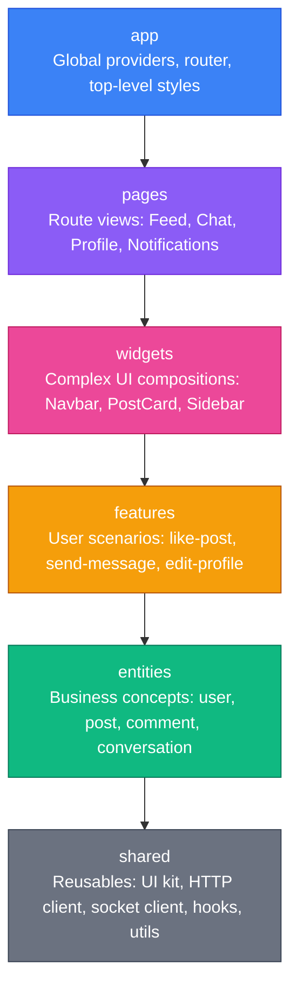
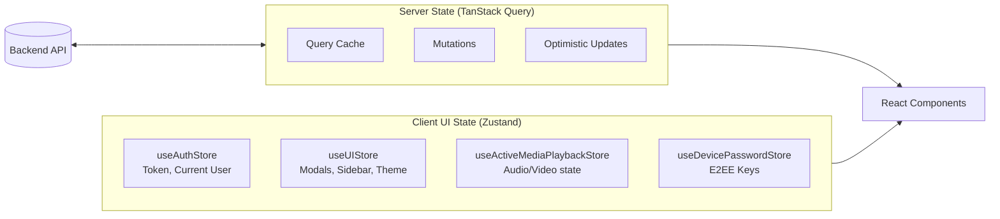

# 🎨 Frontend Architecture (React 19 + FSD)

The frontend is a modern Single Page Application (SPA) built with **React 19**, **Vite 8**, and **Tailwind CSS 4**, architected according to the **Feature-Sliced Design (FSD)** methodology.

---

## 🏛️ Feature-Sliced Design (FSD) Hierarchy

Code is organized into standardized slices and layers. Imports are strictly unidirectional: **modules may only import from lower layers**.



### FSD Layer Guidelines

| Layer       | Responsibility                                                                                  | Allowed Imports                              | Forbidden                                   |
| :---------- | :---------------------------------------------------------------------------------------------- | :------------------------------------------- | :------------------------------------------ |
| `app/`      | Global entry point, routing tree, React Query client setup, global CSS.                         | All lower layers.                            | None.                                       |
| `pages/`    | Assembles widgets and features into complete page screens (e.g. `FeedPage`, `ChatPage`).        | `widgets`, `features`, `entities`, `shared`. | `app`, other sibling pages.                 |
| `widgets/`  | Self-contained, multi-feature UI blocks (e.g. `HeaderNavbar`, `ConversationView`, `PostList`).  | `features`, `entities`, `shared`.            | `app`, `pages`, other sibling widgets.      |
| `features/` | User actions that yield value (e.g. `likePost`, `sendMessage`, `createStory`, `votePoll`).      | `entities`, `shared`.                        | `widgets`, `pages`, other sibling features. |
| `entities/` | Domain models, types, UI cards, entity-specific hooks (e.g. `UserAvatar`, `PostAuthorHeader`).  | `shared`.                                    | `features`, `widgets`, `pages`.             |
| `shared/`   | Generic tools: UI component library (Buttons, Modals, Dropdowns), API client, Socket singleton. | External libraries only.                     | Any upper layers.                           |

### Public API Isolation Rule

> [!IMPORTANT]
>
> - Every slice MUST expose its interface strictly through a root `index.ts` file (Public API).
> - **Deep internal imports are forbidden** (e.g. `import { PostCard } from '@/widgets/PostCard'` is required; `import { PostCard } from '@/widgets/PostCard/ui/PostCard'` is an architectural violation).

---

## ⚡ State Management Architecture

State is cleanly partitioned between **Server State** and **Client State**:



### 1. Server State: TanStack Query (React Query)

- **Declarative Fetching**: Queries manage caching, background re-fetching, deduplication, and garbage collection.
- **Optimistic Updates**: High-frequency actions (liking posts, casting poll votes, adding comments) update local caches immediately before network completion, reverting automatically if the server responds with an error.
- **Deterministic Invalidation**: Mutation success hooks trigger targeted query invalidations using structured query keys:
  ```typescript
  export const postKeys = {
    all: ['posts'] as const,
    feed: (filter: string) => [...postKeys.all, 'feed', filter] as const,
    detail: (id: string) => [...postKeys.all, 'detail', id] as const,
  };
  ```

### 2. Client UI State: Zustand

- Lightweight, zero-boilerplate reactive stores without complex reducer boilerplate:
  - `useAuthStore`: Holds active session tokens and authenticated user metadata.
  - `useUIStore`: Coordinates modals, drawers, active dialogs, and responsive sidebar state.
  - `useDevicePasswordStore`: Manages local decrypted session keys for End-to-End Encryption (E2EE).
  - `useActiveMediaPlaybackStore`: Synchronizes global media playback so playing a video pauses background audio.

---

## 🚀 Advanced Client Performance & Offline Engines

### 1. Client-Side Pre-Compression (Web Worker + OffscreenCanvas)

To guarantee instant uploads even on slow mobile networks (3G/LTE) while saving ~95% server CPU and bandwidth:
- Images are processed inside an isolated **Web Worker** before any network request is initiated.
- Utilizes `OffscreenCanvas` with bicubic downscaling to max 1920px dimensions and exports to modern `image/webp` (80% quality).
- A typical 12MB raw smartphone photo is reduced to ~250KB in under 120ms on client hardware without freezing the main UI thread.

### 2. Predictive Viewport Prefetching

- `usePredictivePrefetch`: Combines IntersectionObserver and scroll velocity monitoring.
- High-probability assets (author profile headers, post comment threads, and next-page pagination segments) are silently fetched into TanStack Query cache moments before the user scrolls them into the active viewport, delivering perceived 0ms navigation latency.

### 3. Persistent Mutation Outbox Queue (Offline Send)

Implements Telegram-grade offline resilience for messaging and posts:
- Mutations initiated while offline or unstable are persisted locally in **IndexedDB** (`outboxStore`).
- Outbox worker automatically drains the queue with exponential backoff and network reconnection listeners.
- Guarantees exactly-once processing with cryptographically generated UUIDv4 idempotency keys (`clientMessageId`).

### 4. P2P WebRTC Mesh Voice Channels

Provides real-time group voice rooms (up to 4–6 peers) with zero media server hosting costs:
- **Full Mesh Topology**: Browsers establish direct peer-to-peer `RTCPeerConnection` audio streams over UDP.
- **Signalling Relay**: The NestJS Socket.IO gateway handles SDP Offer/Answer exchanges and ICE candidate dispatch (`voice:mesh-*`).
- **Interactive Waveforms**: Renders real-time audio visualization using decoded `waveform Int[]` data and Canvas physics.

### 5. WebCrypto End-to-End Encryption (E2EE)

- Pure browser-native **WebCrypto API** (`SubtleCrypto`): ECDH P-256 key agreement with AES-GCM-256 message encryption.
- **Secret Chat Verification**: In-app QR code & SAS (Short Authentication String) emoji comparison modal verifying cryptographic fingerprint integrity against Man-in-the-Middle (MitM) attacks.

---

## 🔌 Real-time WebSocket Client

The frontend maintains a persistent Socket.IO connection defined in `shared/api/socketClient.ts`:

- **Automatic Reconnection**: Exponential backoff with queue buffering for events sent while offline.
- **Presence & Activity**: Heartbeats broadcast active state and dynamically receive `userOnline` / `userOffline` broadcasts.
- **Room Synchronization**: Navigating to a chat automatically triggers `joinConversation` and unsubscribes via `leaveConversation` upon unmount.
- **Direct Cache Synthesis**: Incoming message events inject records directly into TanStack Query caches without requiring full refetches.

---

## 📝 Form Validation & Contract Integration

Forms use **React Hook Form** paired with **Zod resolver**:

- Forms validate against the same Zod contracts defined by the backend (`@backend/common/contracts` or `@common/contracts`).
- Client-side validation errors display inline instantly before any HTTP request leaves the browser.
- Type inference ensures form values strictly conform to API DTOs.

---

## ⚡ React Compiler & Performance Optimizations

- **React Compiler (`babel-plugin-react-compiler`)**: Automatically handles memoization. Developers rarely need to write manual `useMemo` or `useCallback` hooks.
- **Route-Level Code Splitting**: All pages are lazy-loaded via `React.lazy()` and `Suspense`, ensuring the initial JavaScript bundle stays under ~120KB gzipped.
- **Virtualization**: Long feeds and chat message histories utilize windowing for 60 FPS scrolling performance.
- **Responsive Layouts**: Mobile-first design with bottom navigation bars on small viewports and collapsible three-column layouts on desktop.

