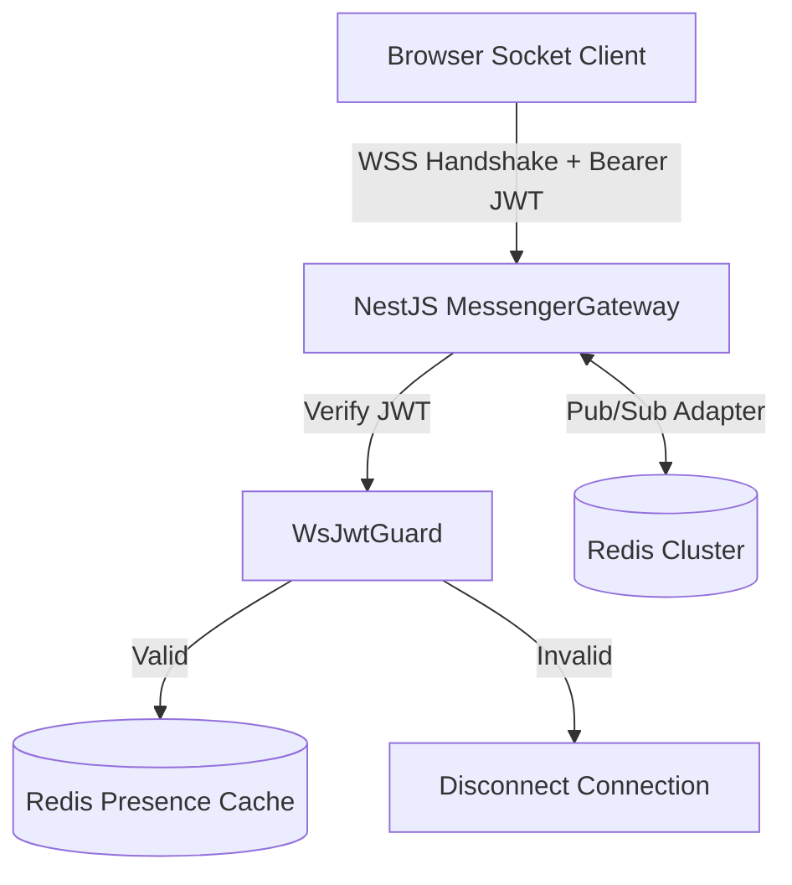

# ⚡ Real-Time Architecture & WebSocket Gateway

The real-time communication layer is powered by **Socket.IO 4** running within NestJS (`MessengerGateway`), backed by **Redis** for horizontal multi-node scaling. It manages instant messaging, presence status, typing indicators, reactions, and live notification pushes.

---

## 🌐 Connection & Authentication

### Gateway Endpoint

- **Namespace**: `/messenger`
- **Transport**: WebSocket with polling fallback (`transports: ['websocket', 'polling']`)
- **Adapter**: `@socket.io/redis-adapter` (enables cross-node pub/sub broadcasting)



### Handshake Authentication

Clients must supply a valid JWT access token during connection establishment:

```typescript
import { io } from 'socket.io-client';

const socket = io('https://api.socialnetwork.dev/messenger', {
  auth: {
    token: accessToken, // Alternatively via extraHeaders: { Authorization: `Bearer ${accessToken}` }
  },
  transports: ['websocket'],
});
```

If authentication fails, the gateway emits an `unauthorized` error and terminates the socket connection.

---

## 🚪 Room Architecture

The gateway organizes sockets into granular communication channels:

| Room Pattern                     | Scope                 | Purpose                                                                                                   |
| :------------------------------- | :-------------------- | :-------------------------------------------------------------------------------------------------------- |
| `user:${userId}`                 | User personal channel | Dispatches personal alerts, notifications, friend requests, and direct calls.                             |
| `conversation:${conversationId}` | Conversation channel  | Synchronizes message exchanges, typing indicators, and message edits/deletions among active participants. |

---

## 📡 Event Protocol Catalog

### 1. Client → Server Events

#### `joinConversation`

Registers the socket to receive live updates for a specific conversation room.

```typescript
socket.emit('joinConversation', { conversationId: 'uuid' });
```

> **Security**: The server verifies that `socket.user.id` is an active participant before allowing room subscription.

#### `leaveConversation`

Unsubscribes the socket from an active conversation room.

```typescript
socket.emit('leaveConversation', { conversationId: 'uuid' });
```

#### `typingStart` / `typingStop`

Broadcasts ephemeral typing indicators to other members of the conversation.

```typescript
socket.emit('typingStart', { conversationId: 'uuid' });
// When typing pauses for > 2500ms:
socket.emit('typingStop', { conversationId: 'uuid' });
```

#### `markRead`

Signals that the user has viewed messages up to a specific timestamp or ID.

```typescript
socket.emit('markRead', { conversationId: 'uuid', lastReadMessageId: 'uuid' });
```

---

### 2. Server → Client Events

#### `newMessage`

Broadcast whenever a participant posts a message to the conversation.

```json
{
  "id": "uuid",
  "conversationId": "uuid",
  "senderId": "uuid",
  "content": "Encrypted or Plaintext message payload",
  "media": [],
  "createdAt": "2026-09-04T12:00:00.000Z",
  "sender": {
    "id": "uuid",
    "username": "alice",
    "displayName": "Alice",
    "avatar": "https://..."
  }
}
```

#### `messageReaction`

Dispatched when an emoji reaction is added or removed from a message.

```json
{
  "messageId": "uuid",
  "conversationId": "uuid",
  "userId": "uuid",
  "emoji": "🔥",
  "action": "ADD"
}
```

#### `messageDeleted`

Notifies participants that a message has been retracted.

```json
{
  "messageId": "uuid",
  "conversationId": "uuid",
  "deletedForEveryone": true
}
```

#### `typingUpdate`

Streamed to room members when someone starts or stops typing.

```json
{
  "conversationId": "uuid",
  "userId": "uuid",
  "username": "bob",
  "isTyping": true
}
```

#### `userPresenceChanged`

Sent to friends/chat partners when a user toggles between online and offline.

```json
{
  "userId": "uuid",
  "status": "online",
  "lastSeenAt": "2026-09-04T18:00:00.000Z"
}
```

#### `notificationReceived`

Pushes high-priority activity alerts directly to `user:${userId}`.

```json
{
  "id": "uuid",
  "type": "POST_LIKE",
  "actor": { "username": "carol", "avatar": "https://..." },
  "entityId": "uuid",
  "message": "carol liked your post"
}
```

---

## 🔄 Optimistic Reconciliation on the Frontend

To ensure sub-10ms UI responsiveness, the frontend executes an **optimistic UI pattern**:

1. **Immediate Render**: When the user hits send, a temporary message with status `sending` is placed directly into the TanStack Query conversation cache.
2. **HTTP Transmission**: Message payloads are sent via HTTP `POST /api/chat/conversations/:id/messages` (allowing multipart attachments and robust retry logic).
3. **Gateway Broadcast**: The backend persists the message and emits `newMessage` via Socket.IO to the room.
4. **Cache Reconciliation**: The sender's client receives the broadcast (or HTTP response), replaces the temporary message ID with the permanent database UUID, and switches status to `delivered`.
