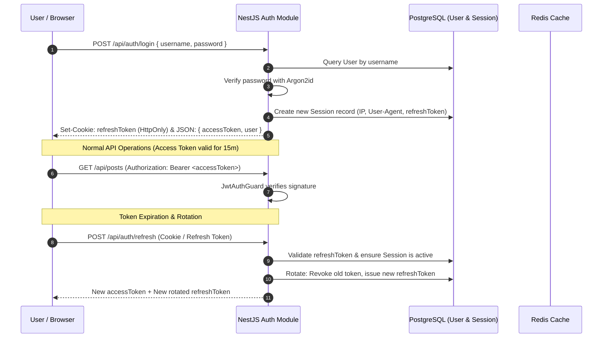
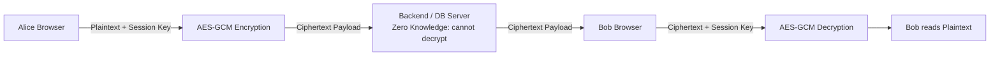
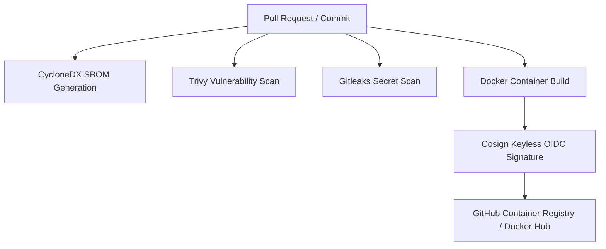

# 🔐 Security & Privacy Architecture

Security and user privacy are fundamental pillars of the Social Network architecture. The system employs defense-in-depth principles spanning authentication, end-to-end cryptography, network hardening, and software supply chain protection.

---

## 🔑 Authentication & Session Lifecycle

### Key Security Standards:

1. **Password Hashing**: Stored using **Argon2id**, the winner of the Password Hashing Competition (PHC), configured with memory-hard parameters resisting GPU and ASIC brute-force cracking.
2. **Access Tokens**: Short-lived (15 minutes), stateless JWTs signed using HMAC SHA-256 or asymmetric keys.
3. **Refresh Tokens**: Long-lived (7 days), strictly rotated upon every renewal. Replaying an already-consumed refresh token triggers immediate session revocation across all devices (theft detection).
4. **Multi-Device Session Management**: Users can inspect all active sessions (device type, operating system, IP address, last activity) in profile settings and revoke individual or all other sessions with one click.

---

## 🔒 End-to-End Encryption (E2EE)

For private conversations, messages are encrypted directly on the client before network transmission:

- **Algorithm**: **AES-256-GCM** with unique per-message Initialization Vectors (IV).
- **Key Derivation**: Client keys are derived from user device passwords using PBKDF2 with 100,000 iterations via WebCrypto API.
- **Zero Knowledge**: The backend never receives the raw encryption passphrase or private keys; messages are stored in PostgreSQL solely as encrypted ciphertext envelopes.

---

## 🛡️ Rate Limiting & Abuse Prevention

The backend integrates `@nestjs/throttler` with a distributed **Redis** store to protect endpoints against brute force, credential stuffing, and spam attacks:

| Endpoint Target           | Window | Max Requests | Action on Exceeded                   |
| :------------------------ | :----- | :----------- | :----------------------------------- |
| `POST /api/auth/login`    | 60s    | 5 attempts   | `429 Too Many Requests` + IP backoff |
| `POST /api/auth/register` | 60s    | 3 attempts   | `429 Too Many Requests`              |
| `POST /api/chat/messages` | 10s    | 20 messages  | `429 Too Many Requests`              |
| Global API Endpoints      | 60s    | 120 requests | `429 Too Many Requests`              |

---

## 🌐 Network & HTTP Hardening

- **Fastify Helmet (`@fastify/helmet`)**: Injects strict HTTP security headers:
  - `Content-Security-Policy`: Disallows unauthorized script execution and restricting connections strictly to API/CDN endpoints.
  - `Strict-Transport-Security` (HSTS): Enforces HTTPS with `max-age=31536000; includeSubDomains; preload`.
  - `X-Content-Type-Options: nosniff`: Mitigates MIME confusion vulnerabilities.
  - `X-Frame-Options: DENY`: Prevents clickjacking framing attacks.
- **Strict CORS**: Origins are strictly validated against environment-defined whitelists (`CORS_ORIGIN`). Wildcards (`*`) are disallowed when credentials are enabled.
- **Payload Limits**: Fastify enforces maximum body limits (`maxParamLength`, `bodyLimit: 10MB`) to eliminate denial-of-service memory pressure.

---

## 📦 Supply Chain & Artifact Security

As an open-source project, supply chain integrity is safeguarded through automated CI controls (see [ADR 003](../adr/003-supply-chain-security-and-cosign.md)):

1. **Lockfile & Scripts Lockdown**: Root `package.json` specifies `allowScripts`, blocking third-party npm packages from executing arbitrary postinstall hooks unless explicitly whitelisted.
2. **Keyless Signing with Cosign**: Container images published during releases are cryptographically signed via Sigstore / Cosign using GitHub Actions OIDC tokens.
3. **Automated Secret Detection**: `gitleaks` runs on pre-commit git hooks and GitHub Actions to prevent API keys or credentials from entering Git history.
4. **Vulnerability Scanning**: Automated Trivy scans block builds containing high or critical CVE vulnerabilities.
