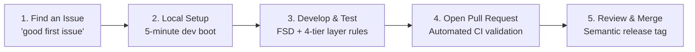

# 🤝 Contributing to Social Network

Welcome! Social Network is a 100% open-source, full-stack application built for real-time scale, privacy, and community. We believe in open collaboration and warmly welcome contributions from developers, designers, technical writers, and testers around the globe.

Whether you are fixing a typo in the documentation, optimizing a SQL query, or implementing a new social feed feature, your contribution matters.

---

## 🧭 Contributor Journey

---

## 📚 Contributor Handbook Index

| Guide                                                    | Summary                                                             |
| :------------------------------------------------------- | :------------------------------------------------------------------ |
| **[Local Getting Started](getting-started.md)**          | Step-by-step 5-minute setup with Docker, pnpm, and Prisma           |
| **[Contribution Workflow](workflow.md)**                 | GitHub Issues, branch conventions, PR lifecycle, and code review    |
| **[Coding Standards & Invariants](coding-standards.md)** | Backend 4-tier architecture, React FSD layers, Zod validation       |
| **[Testing & Verification](testing.md)**                 | Running Jest E2E, Vitest integration, mutation, and k6 stress tests |

---

## 🎯 How Can You Contribute?

1. **Bug Reports & Feature Ideas**: Search existing [GitHub Issues](https://github.com/rakuzan-knu/social-network/issues). If not found, open a new issue using our templates.
2. **Code Contributions**: Look for issues labeled [`good first issue`](https://github.com/rakuzan-knu/social-network/labels/good%20first%20issue) or [`help wanted`](https://github.com/rakuzan-knu/social-network/labels/help%20wanted).
3. **Documentation**: Improve guides, fix typos, add diagrams, or expand API examples in `docs/`.
4. **Performance & Security**: Conduct benchmarks or report security vulnerabilities privately via GitHub Security Advisories.

---

## 📜 Code of Conduct

All participants in our project are expected to adhere to our [Code of Conduct](../../CODE_OF_CONDUCT.md). Please be respectful, constructive, and inclusive.
