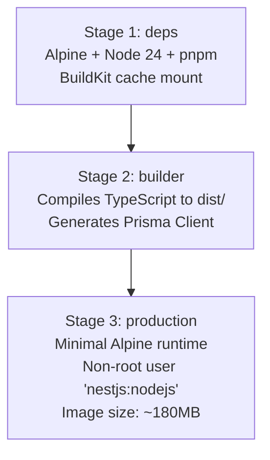
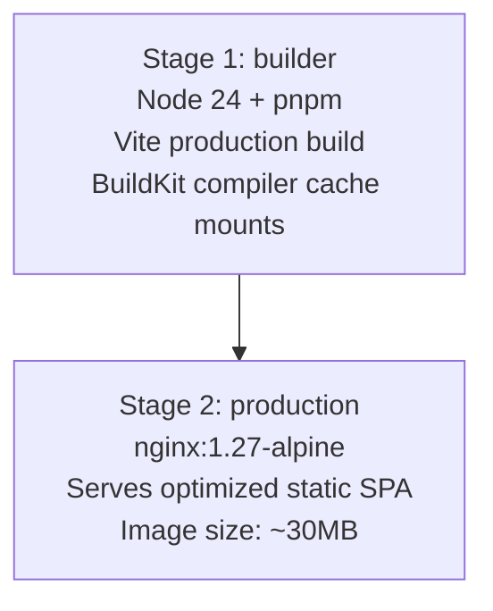

# 🐳 Docker Build & Security Hardening Guide

The project utilizes multi-stage Docker builds optimized with **BuildKit** layer caching, minimal Alpine base images, and non-root execution for both frontend and backend containers.

---

## 🏗️ Multi-Stage Architecture

### 1. Backend Dockerfile (`backend/Dockerfile`)



#### Key Hardening & Performance Features:

- **BuildKit Package Caching**: Uses `--mount=type=cache,target=/root/.pnpm-store` to reduce warm build times to `< 2 seconds`.
- **Parallel Monorepo Package Compilation**: Uses `pnpm --parallel --filter @social-network/common --filter @social-network/backend run build` to utilize all CPU cores concurrently during Docker build stages.
- **Non-Root Execution**: Runs as dedicated user `nestjs:nodejs` (UID/GID 1001), preventing container breakout privilege escalation.
- **Signal Handling via Tini**: Uses `tini` as `ENTRYPOINT` to handle `SIGTERM` and `SIGINT` gracefully and clean up zombie processes.
- **Stripped Runtime Artifacts**: Development devDependencies, source `.ts` files, and build tools are completely excluded from the final image.

---

### 2. Frontend Dockerfile (`frontend/Dockerfile`)



#### Key Hardening & Performance Features:

- **Ultra-Small Footprint**: Static bundle served via hardened Nginx Alpine image (~30MB total).
- **BuildKit Cache Mounts**: Vite and pnpm compiler caches mounted directly via `--mount=type=cache,target=/root/.pnpm-store` and `--mount=type=cache,target=/root/.cache`, accelerating incremental production asset bundling.
- **Hardened Nginx Configuration**:
  - Non-root execution (`USER nginx`).
  - Gzip and Brotli compression enabled for `.js`, `.css`, and `.svg`.
  - Cache headers (`Cache-Control: public, max-age=31536000, immutable` for hashed assets; `no-cache` for `index.html`).
  - Strict security headers (`X-Frame-Options`, `X-Content-Type-Options`, `Referrer-Policy`).

---

## ⚡ CI Build Optimization & De-duplication

To minimize GitHub Actions CI duration and eliminate redundant Docker image builds:
1. **De-duplicated PR Triggers**: The heavy `docker-build.yml` registry publisher workflow only runs on `push` to `main`/`develop` or SemVer git tags. PR branches skip the full multi-architecture container registry push, saving up to 60% of PR CI run time.
2. **Zero-Overhead Container Smoke Test**: In the primary `ci.yml` pipeline, built images are verified via rapid detached smoke execution (`docker run -d --rm ...` with health check verification) without pushing large layer blobs across the network.
3. **Hardened `.dockerignore`**: Excludes local developer artifacts (`.agents/`, `docs/`, `benchmarks/`, Playwright test runs, Storybook build output, Vitest cache, and Stryker reports) from Docker context transfer.

---

## 📊 Image Size & Build Performance

| Image Target     | Base Image          | Cold Build | Warm Build (Cached) | Production Image Size |
| :--------------- | :------------------ | :--------- | :------------------ | :-------------------- |
| **Backend API**  | `node:24-alpine`    | ~2.5 min   | ~1.5 sec            | **~180 MB**           |
| **Frontend SPA** | `nginx:1.27-alpine` | ~1.5 min   | ~1.2 sec            | **~30 MB**            |

---

## 🚀 Building & Running Locally

### Enable BuildKit

Ensure Docker BuildKit is active:

```bash
export DOCKER_BUILDKIT=1
```

### Build Images

```bash
# Build Backend image
docker build -t social-network-backend:latest -f backend/Dockerfile .

# Build Frontend image
docker build -t social-network-frontend:latest ./frontend
```

### Run Full Production Stack with Docker Compose

The production compose configuration starts all services including PostgreSQL, Redis, MinIO, Backend, and Frontend:

```bash
# Boot production stack in detached mode
pnpm docker:prod:up

# View aggregated logs
pnpm docker:prod:logs

# Gracefully stop production stack
pnpm docker:prod:down
```

### Clean / Reset Containers & Volumes

```bash
pnpm docker:clean
```
