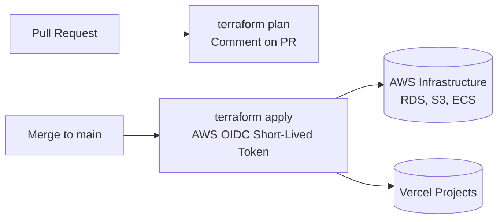

# 🤖 GitOps Infrastructure Automation & OIDC Setup

This guide details how infrastructure inside `infrastructure/` is managed using **Terraform** and **OpenID Connect (OIDC)** via GitHub Actions (`.github/workflows/terraform.yml`).

---

## 🎯 Architecture Overview



Changes are planned automatically on PRs and applied on merge to `main` without storing long-lived AWS static credentials in repository secrets.

---

## 🔑 AWS OIDC Role Integration (Zero Static Keys)

To authenticate GitHub Actions directly with AWS IAM:

### 1. Configure IAM OIDC Identity Provider

Create an IAM OIDC Identity Provider for `https://token.actions.githubusercontent.com` with audience `sts.amazonaws.com`.

### 2. Create IAM Role Trust Policy

```json
{
  "Version": "2012-10-17",
  "Statement": [
    {
      "Effect": "Allow",
      "Principal": {
        "Federated": "arn:aws:iam::<ACCOUNT_ID>:oidc-provider/token.actions.githubusercontent.com"
      },
      "Action": "sts:AssumeRoleWithWebIdentity",
      "Condition": {
        "StringEquals": {
          "token.actions.githubusercontent.com:aud": "sts.amazonaws.com"
        },
        "StringLike": {
          "token.actions.githubusercontent.com:sub": "repo:rakuzan-knu/social-network:*"
        }
      }
    }
  ]
}
```

### 3. Set Repository Secrets in GitHub

- `AWS_ROLE_ARN`: `arn:aws:iam::<ACCOUNT_ID>:role/github-actions-terraform-role`
- `AWS_REGION`: `us-east-1`
- `VERCEL_API_TOKEN`: Vercel Personal Access Token for automation

---

## 🗄️ Remote State Locking (S3 + DynamoDB)

State locking prevents concurrent Terraform executions from corrupting infrastructure state:

```hcl
// infrastructure/main.tf
terraform {
  backend "s3" {
    bucket         = "social-network-tf-state"
    key            = "prod/terraform.tfstate"
    region         = "us-east-1"
    dynamodb_table = "social-network-tf-locks"
    encrypt        = true
  }
}
```
