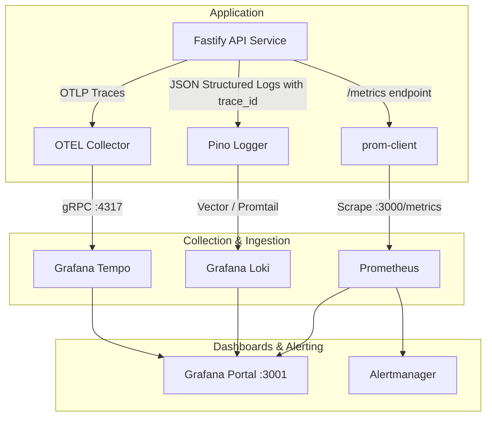

# 📊 Observability & Monitoring Stack

The platform features a complete, self-contained telemetry stack powered by **Prometheus**, **Grafana**, **Grafana Loki**, **Grafana Tempo**, and **OpenTelemetry (OTEL)**.

---

## 🏗️ Telemetry Architecture



---

## 📁 Monitoring Documentation Index

| Guide                                        | Description                                                                            |
| :------------------------------------------- | :------------------------------------------------------------------------------------- |
| [Monitoring Quickstart](quickstart.md)       | How to boot the full monitoring profile in Docker Compose                              |
| [Monitoring Setup & Alerts](setup.md)        | Detailed dashboard configuration, metric definitions, and alert rules                  |
| [Distributed Tracing with Tempo](tracing.md) | End-to-end distributed tracing, OpenTelemetry integration, and log-to-trace navigation |

---

## ⚡ Quick Launch Command

To boot the entire monitoring stack alongside the application:

```bash
docker compose -f docker-compose.prod.yml --profile monitoring up -d
```

- **Grafana**: [http://localhost:3001](http://localhost:3001) (Default credentials: `admin` / `admin`)
- **Prometheus**: [http://localhost:9090](http://localhost:9090)
- **Loki Logs Engine**: `http://localhost:3100`
- **Tempo Trace Engine**: `http://localhost:3200`
