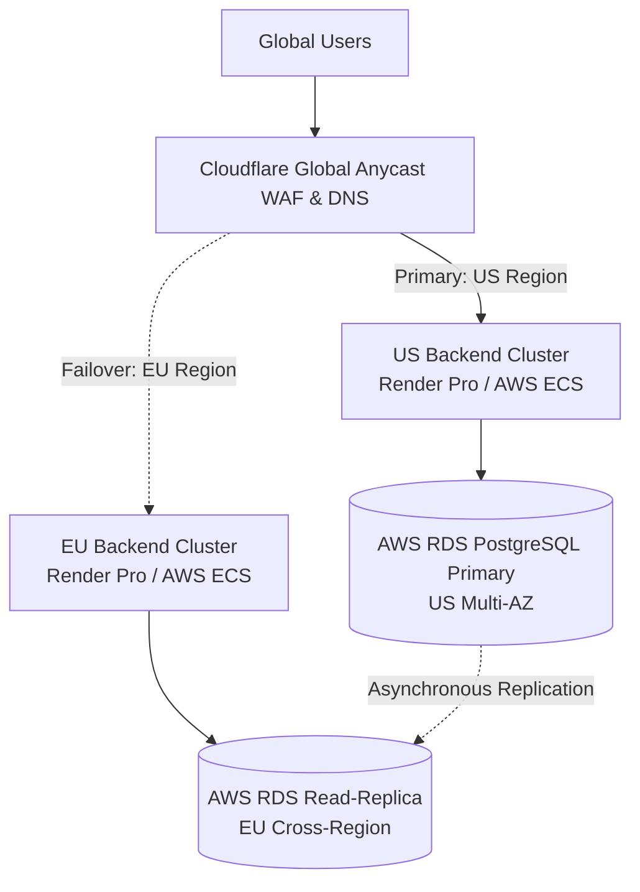

# 🌐 High Availability (HA) & Disaster Recovery (DR) Strategy

This document outlines our operational architecture for high availability, fault tolerance, and cross-region disaster recovery.

---

## 🎯 Emergency Recovery Objectives

| Metric                             | Target SLA                              | Verification Mechanism                                                   |
| :--------------------------------- | :-------------------------------------- | :----------------------------------------------------------------------- |
| **Recovery Time Objective (RTO)**  | `< 2 minutes` (Automated DNS failover)  | Automated bi-weekly DR drill (`.github/workflows/dr-failover-drill.yml`) |
| **Recovery Point Objective (RPO)** | `< 1 minute` (Database WAL replication) | Asynchronous cross-region encrypted backup sync                          |

---

## 🔒 Backup Encryption at Rest (`scripts/db/backup-db.sh`)

All database backups are encrypted at rest using **AES-256-CBC** with PBKDF2 key derivation:

```bash
pg_dump ... | gzip | openssl enc -aes-256-cbc -pbkdf2 -iter 100000 -pass env:BACKUP_ENCRYPTION_KEY > backup.sql.gz.enc
```

- Plaintext database dumps are never written unencrypted to disk.
- Backups are automatically verified through in-memory restore testing (`scripts/db/verify-backup.sh`).

---

## 🚀 Multi-Region HA Architecture



### Failover Trigger Conditions:

1. Primary API backend `/api/health` probes fail continuously for 60 seconds (2 consecutive check intervals).
2. Primary cloud provider availability zone undergoes critical infrastructure outage.
3. Automated runbook (`scripts/deploy/execute-dr-failover.cjs`) executes to promote secondary read-replica and re-route Cloudflare DNS traffic.
