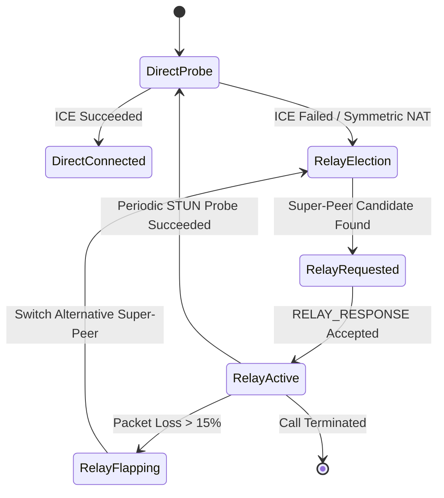

```text
Network Working Group                                          A. Developer
Internet-Draft                                                  Independent
Intended status: Standards Track                          September 6, 2026
Expires: March 10, 2027


Peer-to-Peer Gossip Signaling and Dynamic Mesh Relay for WebRTC
                 draft-ietf-p2p-mesh-relay-01

Abstract

   This document specifies a decentralized signaling redundancy and
   media relay protocol for WebRTC endpoints operating in multi-party
   mesh topologies.  By combining an epidemic gossip dissemination
   protocol over RTCDataChannel with autonomous super-peer bandwidth
   sharing, endpoints maintain low-latency signaling continuity during
   central signaling server outages and establish zero-cost media relays
   for symmetric NAT traversal without requiring centralized TURN
   infrastructure.

Status of This Memo

   This Internet-Draft is submitted in full conformance with the
   provisions of BCP 78 and BCP 79.

   Internet-Drafts are working documents of the Internet Engineering
   Task Force (IETF).  Note that other groups may also distribute
   working documents as Internet-Drafts.  The list of current Internet-
   Drafts is at https://datatracker.ietf.org/drafts/current/.

   Internet-Drafts are draft documents valid for a maximum of 6 months
   and may be updated, replaced, or obsoleted by other documents at any
   time.  It is inappropriate to use Internet-Drafts as reference
   material or to cite them other than as "work in progress."

   This Internet-Draft will expire on March 10, 2027.

Copyright Notice

   Copyright (c) 2026 IETF Trust and the persons identified as the
   document authors.  All rights reserved.

   This document is subject to BCP 78 and the IETF Trust's Legal
   Provisions Relating to IETF Documents
   (https://trustee.ietf.org/license-info) in effect on the date of
   publication of this document.  Please review these documents
   carefully, as they describe your rights and restrictions with respect
   to this document.
```

Table of Contents

1.  Introduction . . . . . . . . . . . . . . . . . . . . . . . . . 2
2.  Terminology . . . . . . . . . . . . . . . . . . . . . . . . . . 3
3.  Protocol Overview . . . . . . . . . . . . . . . . . . . . . . . 3
    3.1. Dual-Layer Architecture . . . . . . . . . . . . . . . . . 3
    3.2. Network Topology & Super-Peer Election . . . . . . . . . 4
4.  Formal ABNF Message Grammar . . . . . . . . . . . . . . . . . . 5
    4.1. Gossip Frame Structure . . . . . . . . . . . . . . . . . 5
    4.2. Payload Types and Encoding . . . . . . . . . . . . . . . 6
5.  Dynamic Mesh Relay Algorithm . . . . . . . . . . . . . . . . . 7
    5.1. Peer Capability Vector . . . . . . . . . . . . . . . . . 7
    5.2. Super-Peer Election & Scoring . . . . . . . . . . . . . . 8
    5.3. Media Forwarding State Machine . . . . . . . . . . . . . 9
6.  End-to-End Encryption (E2EE) Compatibility . . . . . . . . . . 10
7.  Congestion Control & Backpressure . . . . . . . . . . . . . . . 11
8.  Security Considerations . . . . . . . . . . . . . . . . . . . . 12
    8.1. Sybil and Eclipse Attacks . . . . . . . . . . . . . . . . 12
    8.2. Traffic Amplification & DoS Prevention . . . . . . . . . 12
    8.3. Malicious Relay Eavesdropping . . . . . . . . . . . . . . 13
9.  IANA Considerations . . . . . . . . . . . . . . . . . . . . . . 13
    9.1. WebSocket Subprotocol Registration . . . . . . . . . . . 13
    9.2. WebRTC DataChannel Protocol Identifier . . . . . . . . . 14
10. References . . . . . . . . . . . . . . . . . . . . . . . . . . 14
    10.1. Normative References . . . . . . . . . . . . . . . . . . 14
    10.2. Informative References . . . . . . . . . . . . . . . . . 14

11. Introduction

Real-time communications over the Web (WebRTC, [RFC8825]) rely
fundamentally on an out-of-band signaling mechanism to exchange
Session Description Protocol (SDP, [RFC8866]) offers, answers, and
Interactive Connectivity Establishment (ICE, [RFC8445]) candidate
information. In conventional architectures, this signaling channel
is hosted on centralized WebSocket, HTTP/3, or SIP servers.

When centralized signaling infrastructure experiences distributed
denial-of-service (DDoS) events, cloud datacenter outages, or
aggressive edge firewall throttling, in-flight WebRTC sessions
frequently collapse due to an inability to negotiate dynamic ICE
restarts or route renegotiation messages. Furthermore, when direct
peer-to-peer connectivity is impeded by double-symmetric NAT or CGNAT
(Carrier-Grade NAT) firewalls, sessions must fall back to Traversal
Using Relays around NAT (TURN, [RFC8656]) servers, introducing
prohibitive bandwidth costs ($0.05 - $0.15/GB) and centralized
points of failure.

This specification defines the Peer-to-Peer Gossip Signaling and
Dynamic Mesh Relay Protocol (`P2P-Gossip-Relay`). The protocol
provides:

1.  Autonomous signaling redundancy by gossiping control messages
    (SDP mutations, ICE candidate updates, participant rosters)
    across established RTCDataChannel connections between peers.

2.  Decentralized peer-assisted media relaying, allowing well-
    provisioned nodes (super-peers) with public IP addresses or full-
    cone NAT to transparently bridge media between restrictive NAT
    endpoints with zero centralized TURN egress costs.

3.  Cryptographic isolation ensuring that intermediary relay nodes
    cannot inspect or tamper with media frames or signaling payloads,
    leveraging SFrame ([RFC9605]) and Post-Quantum hybrid keys.

4.  Terminology

The key words "MUST", "MUST NOT", "REQUIRED", "SHALL", "SHALL NOT",
"SHOULD", "SHOULD NOT", "RECOMMENDED", "NOT RECOMMENDED", "MAY", and
"OPTIONAL" in this document are to be interpreted as described in
BCP 14 [RFC2119] [RFC8174] when, and only when, they appear in all
capitals, as shown here.

In addition, the following terms are used:

Super-Peer: An endpoint possessing sufficient spare upload bandwidth,
low packet loss, and unrestricted NAT mapping capability elected
to relay traffic on behalf of restricted peers.

Restricted Peer: An endpoint behind symmetric NAT or restrictive
firewalls unable to establish direct P2P connections to other
restricted peers without relay assistance.

Gossip Fan-out (k): The number of active peers to which a message
is forwarded during each epidemic gossip propagation step.

3.  Protocol Overview

3.1. Dual-Layer Architecture

The protocol operates on two distinct functional planes:

+-------------------------------------------------------------+
| Application / SFrame Layer |
+-------------------------------------------------------------+
| Signaling Gossip Plane | Peer Media Relay Plane |
| (Epidemic RTCDataChannel) | (DataChannel / RTP Bridge) |
+-----------------------------+-------------------------------+
| SCTP / DTLS / UDP / IP |
+-------------------------------------------------------------+

- The Signaling Gossip Plane executes an anti-entropy epidemic
  propagation model over dedicated reliable, ordered RTCDataChannels
  labeled `p2p-gossip-v1`.

- The Peer Media Relay Plane establishes high-throughput, unordered,
  unreliable RTCDataChannels or nested RTP wrappers labeled
  `mesh-relay-v1` to encapsulate SFrame-encrypted media packets.

3.2. Network Topology & Super-Peer Election

Endpoints maintain a local peer table documenting observed Round Trip
Times (RTT), packet loss rates, NAT traversal types, and available
upstream bandwidth. When direct ICE connectivity fails between Peer A
and Peer B (e.g. `iceConnectionState === 'failed'`), both peers query
the gossip mesh for available Super-Peers and initiate relay binding.

4.  Formal ABNF Message Grammar

All signaling and relay control messages MUST conform to the
following Augmented Backus-Naur Form (ABNF, [RFC5234]) syntax:

```abnf
gossip-packet      = header payload signature
header             = magic version msg-type msg-id src-id dst-id ttl timestamp
magic              = %x50.32.50.47 ; "P2P/"
version            = %x01          ; Version 1
msg-type           = %x01 / %x02 / %x03 / %x04 / %x05 / %x06
                   ; 0x01: ANNOUNCE
                   ; 0x02: GOSSIP_SIGNAL
                   ; 0x03: RELAY_REQUEST
                   ; 0x04: RELAY_RESPONSE
                   ; 0x05: RELAY_HEARTBEAT
                   ; 0x06: RELAY_DATA

msg-id             = 16OCTET       ; UUIDv4 unique identifier
src-id             = 16OCTET       ; Sender Peer UUID
dst-id             = 16OCTET       ; Destination Peer UUID (or 16*0x00 for broadcast)
ttl                = OCTET         ; Time-To-Live hop counter (default: 0x05)
timestamp          = 8OCTET        ; 64-bit Unix Epoch in milliseconds (Big-Endian)

payload            = length-prefixed-data
length-prefixed-data = payload-length *OCTET
payload-length     = 4OCTET        ; 32-bit unsigned integer (Big-Endian)

signature          = 64OCTET       ; Ed25519 or ML-DSA-65 signature over header || payload
```

5.  Dynamic Mesh Relay Algorithm

5.1. Peer Capability Vector

Each peer broadcasts a capability vector $C_i$ every 5 seconds:

$$C_i = \langle B_{up}, \text{NAT}_{type}, L, RTT_{avg}, N_{active} \rangle$$

Where:

- $B_{up}$: Available upload capacity in kilobits per second (kbps)
- $\text{NAT}_{type} \in \{1: \text{Public}, 2: \text{Full-Cone}, 3: \text{Restricted-Cone}, 4: \text{Symmetric}\}$
- $L$: Packet loss fraction $[0.0, 1.0]$
- $RTT_{avg}$: Smoothed RTT to mesh participants in milliseconds
- $N_{active}$: Number of active relay streams currently sustained

5.2. Super-Peer Scoring Function

Endpoints evaluate candidate relay nodes using the objective scoring
metric $S(p)$:

$$S(p) = w_1 \cdot \frac{1}{\max(1, RTT_p)} + w_2 \cdot (1 - L_p) + w_3 \cdot \min\left(1.0, \frac{B_{up, p}}{B_{req}}\right) - w_4 \cdot \frac{N_{active, p}}{N_{max}}$$

Standard normative weights:

- $w_1 = 0.35$ (Latency priority)
- $w_2 = 0.30$ (Reliability priority)
- $w_3 = 0.25$ (Bandwidth headroom priority)
- $w_4 = 0.10$ (Load-balancing penalty)

A node is eligible for Super-Peer promotion if and only if:
$\text{NAT}_{type} \in \{1, 2\}$, $B_{up} \ge 2500\text{ kbps}$, and $L \le 0.03$.

5.3. Media Forwarding State Machine



6.  End-to-End Encryption (E2EE) Compatibility

All relayed media frames MUST be encrypted under the SFrame standard
[RFC9605] before handoff to the Peer Media Relay Plane. Relay nodes
MUST NOT possess session deciphering keys. The frame metadata
(KeyID, Counter) remains unencrypted for framing synchronization,
while ciphertext payloads are completely opaque to the relay node.

7.  Congestion Control & Backpressure

Relay nodes MUST enforce backpressure on `mesh-relay-v1` channels.
When `RTCDataChannel.bufferedAmount` exceeds the high-water threshold
(64 KB), the relay MUST emit a `CONGESTION_BACKOFF` signal to the
originating peer, which MUST immediately downscale video encodings
using `RTCRtpSender.setParameters()`.

8.  Security Considerations

8.1. Sybil and Eclipse Attacks

Malicious actors attempting to flood the gossip network with dummy
peers are mitigated by mandatory cryptographic signatures on all
Gossip Frames. Peers reject messages from identities that do not
match the verified SAS / DTLS fingerprint of the active call session.

8.2. Traffic Amplification & DoS Prevention

To prevent routing loops and amplification storms:

- The TTL field MUST be decremented by exactly 1 at each hop.
- Nodes MUST drop packets with $\text{TTL} = 0$.
- Nodes MUST cache message IDs ($16\text{ bytes}$) for at least 30
  seconds and silently discard duplicate `msg-id` instances.

8.3. Malicious Relay Eavesdropping

Because media frames are encrypted end-to-end with SFrame AEAD keys
derived via ML-KEM / X25519 hybrid exchange, a compromised or
curious relay node cannot inspect audio or video content.

9.  IANA Considerations

9.1. WebSocket Subprotocol Registration

IANA is requested to register the following WebSocket subprotocol
name:

Subprotocol Identifier: `p2p-gossip-v1`
Specification: This RFC

9.2. WebRTC DataChannel Protocol Identifier

IANA is requested to register the following RTCDataChannel protocol:

Protocol Identifier: `mesh-relay-v1`
Specification: This RFC

10. References

10.1. Normative References

[RFC2119] Bradner, S., "Key words for use in RFCs to Indicate
Requirement Levels", BCP 14, RFC 2119, March 1997.
[RFC5234] Crocker, D. and P. Overell, "Augmented BNF for Syntax
Specifications: ABNF", STD 68, RFC 5234, January 2008.
[RFC8174] Leiba, B., "Ambiguity of Uppercase vs Lowercase in RFC
2119 Key Words", BCP 14, RFC 8174, May 2017.
[RFC8445] Keranen, A., Holmberg, C., and J. Rosenberg, "Interactive
Connectivity Establishment (ICE)", RFC 8445, July 2018.
[RFC8825] Alvestrand, H., "Overview: Real-Time Protocols for
Browser-Based Applications", RFC 8825, January 2021.
[RFC8866] Begen, A., Kyzivat, P., Perkins, C., and M. Handley,
"SDP: Session Description Protocol", RFC 8866, January 2021.
[RFC9605] Omara, F. et al., "SFrame: Secure Frame Encryption for
Media", RFC 9605, 2024.

10.2. Informative References

[RFC8656] Reddy, T., Johnston, A., Philip, R., and R. Singh,
"Traversal Using Relays around NAT (TURN)", RFC 8656,
February 2020.
