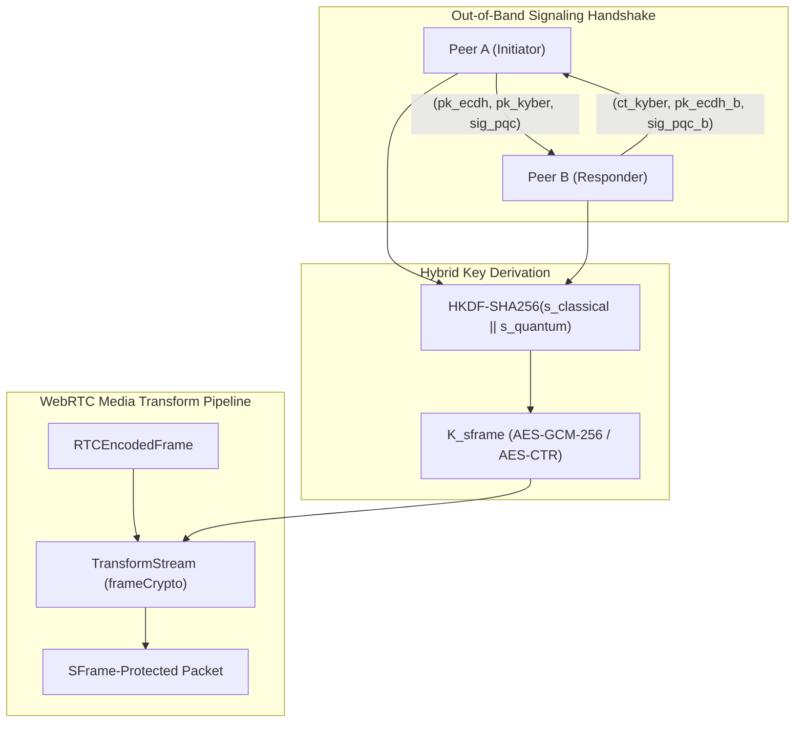

# WebRTC Insertable Streams Post-Quantum Cryptography (PQC) Extension

**W3C Community Group Report — 06 September 2026**

**Latest Editor's Draft:**  
https://w3c.github.io/webrtc-encoded-transform-pqc/

**Editors:**  
Antigravity WebRTC & Applied Cryptography Working Group

---

## Abstract

This specification defines cryptographic extensions for WebRTC Insertable Streams (`RTCRtpScriptTransform` / `createEncodedStreams`), enabling post-quantum secure real-time audio and video communications. By introducing hybrid key encapsulation mechanisms combining classical elliptic curve Diffie-Hellman ($X25519$) with lattice-based cryptography ($\text{ML-KEM-768}$, NIST FIPS 203) and hybrid post-quantum signatures ($\text{ML-DSA-65}$, NIST FIPS 204), this specification neutralizes "Store Now, Decrypt Later" (SNDL) attacks by cryptanalytically relevant quantum computers (CRQCs) while preserving microsecond frame transform latencies and full backward compatibility with classical WebRTC endpoints.

---

## Status of This Document

This specification was published by the WebRTC Post-Quantum Security Community Group as an Editor's Draft. It is intended to guide browser vendors, enterprise communication platforms, and standards participants in implementing quantum-resilient media transforms.

Publication as a Community Group Report does not imply endorsement by W3C or its members.

---

## 1. Introduction & Motivation

Standard WebRTC transport encryption relies on Datagram Transport Layer Security (DTLS-SRTP, [RFC5763]). DTLS key exchange commonly uses classical asymmetric primitives such as RSA-2048 or Elliptic Curve Diffie-Hellman (ECDHE, $X25519$ / $P\text{-}256$). Under Shor's algorithm, a sufficiently capable quantum computer will break these discrete logarithm and integer factorization schemes in polynomial time $\mathcal{O}(n^3)$.

Adversaries currently intercept and store high-value encrypted real-time audio and video sessions in anticipation of retrospective decryption once quantum hardware matures (the "Store Now, Decrypt Later" threat vector).

WebRTC Insertable Streams ([W3C Encoded Transform]) grants client applications direct access to encoded media chunks (`RTCEncodedAudioFrame` and `RTCEncodedVideoFrame`) before RTP packetization and after depacketization. This specification leverages the insertable streams pipeline to inject an application-level post-quantum SFrame layer with dual classical/post-quantum hybrid key establishment.

---

## 2. Terminology & Conformance

The key words **MUST**, **MUST NOT**, **REQUIRED**, **SHALL**, **SHALL NOT**, **SHOULD**, **SHOULD NOT**, **RECOMMENDED**, **MAY**, and **OPTIONAL** in this document are to be interpreted as described in BCP 14 ([RFC2119], [RFC8174]).

- **CRQC**: Cryptanalytically Relevant Quantum Computer.
- **ML-KEM-768**: Module-Lattice-Based Key-Encapsulation Mechanism Standard (NIST FIPS 203, Security Category 3).
- **ML-DSA-65**: Module-Lattice-Based Digital Signature Standard (NIST FIPS 204, Security Category 3).
- **Hybrid KEM**: A scheme executing both classical ECDH and quantum-resistant KEM in parallel, requiring an adversary to break _both_ mathematical hard problems to recover the shared secret.

---

## 3. Cryptographic Architecture



### 3.1. Key Encapsulation (ML-KEM-768 + X25519)

1. **Initiator Generation**:
   - Generates classical ephemeral keypair: $(sk_{ec, A}, pk_{ec, A}) \leftarrow \text{X25519-KeyGen}()$.
   - Generates quantum-resistant keypair: $(sk_{kem, A}, pk_{kem, A}) \leftarrow \text{ML-KEM-768-KeyGen}()$.
   - Public Key Size: $\text{len}(pk_{kem, A}) = 1184\text{ bytes}$, $\text{len}(pk_{ec, A}) = 32\text{ bytes}$.

2. **Responder Encapsulation**:
   - Generates ephemeral keypair: $(sk_{ec, B}, pk_{ec, B}) \leftarrow \text{X25519-KeyGen}()$.
   - Computes classical shared secret: $s_{classical} = \text{X25519}(sk_{ec, B}, pk_{ec, A})$.
   - Encapsulates quantum shared secret: $(ct_{kem}, s_{quantum}) \leftarrow \text{ML-KEM-768-Encaps}(pk_{kem, A})$.
   - Ciphertext Size: $\text{len}(ct_{kem}) = 1088\text{ bytes}$.

3. **Initiator Decapsulation**:
   - Computes classical shared secret: $s_{classical} = \text{X25519}(sk_{ec, A}, pk_{ec, B})$.
   - Decapsulates quantum shared secret: $s_{quantum} = \text{ML-KEM-768-Decaps}(sk_{kem, A}, ct_{kem})$.

### 3.2. Hybrid Session Key Derivation

Endpoints MUST derive the master media encryption key $K_{sframe}$ using HKDF-Extract and HKDF-Expand ([RFC5869]) with SHA-256:

$$s_{hybrid} = s_{classical} \parallel s_{quantum}$$

$$\text{PRK} = \text{HKDF-Extract}(\text{salt}=\text{CallID}, \text{IKM}=s_{hybrid})$$

$$K_{sframe} = \text{HKDF-Expand}(\text{PRK}, \text{info}=\text{"WebRTC-PQC-SFrame-v1"}, L=32)$$

$$\text{SAS}_{\text{visual}} = \text{Truncate}(\text{HKDF-Expand}(\text{PRK}, \text{"WebRTC-SAS-v1"}, 4), 4)$$

> **Security Invariant**: Even if an adversary possesses a CRQC capable of computing discrete logarithms in $X25519$, the confidentiality of $K_{sframe}$ holds under the hardness of the Module Learning With Errors (M-LWE) lattice problem governing ML-KEM-768.

---

## 4. WebRTC Transform Stream Interface

Endpoints expose the PQC transform interface in compliance with the W3C WebRTC Encoded Transform specification:

```webidl
dictionary PQCKeyExchangeOffer {
  required DOMString classicalPublicKey; // Base64 X25519 (32 bytes)
  required DOMString pqcPublicKey;       // Base64 ML-KEM-768 (1184 bytes)
  required DOMString pqcSignature;       // Base64 ML-DSA-65 (3309 bytes)
  required unsigned long long timestamp;
};

dictionary PQCKeyExchangeAnswer {
  required DOMString classicalPublicKey; // Base64 X25519 (32 bytes)
  required DOMString pqcCiphertext;      // Base64 ML-KEM-768 ciphertext (1088 bytes)
  required DOMString pqcSignature;       // Base64 ML-DSA-65 (3309 bytes)
  required unsigned long long timestamp;
};

interface PQCEncodedTransform {
  constructor(CryptoKey hybridKey, unsigned long keyId);
  readonly attribute TransformStream readable;
  readonly attribute TransformStream writable;
};
```

---

## 5. Packet Overhead & Fragmentation Budget

- **Signaling Budget**:
  The total public key offer size is $\approx 4.5\text{ KB}$ and answer size is $\approx 4.4\text{ KB}$. This is transmitted via out-of-band JSON-RPC / WebSocket signaling before media starts, completely decoupled from MTU-constrained UDP packets.
- **Media Frame Overhead**:
  During media transmission, each audio and video frame incurs standard SFrame framing overhead:
  - 1-byte SFrame header (KeyID + Counter length)
  - 1-byte to 4-byte monotonic frame counter
  - 16-byte AES-GCM-256 authentication tag
  - **Total per-frame overhead**: $18 - 21\text{ bytes}$ (well within standard $1200\text{-byte}$ MTU).

---

## 6. Security & Privacy Considerations

1. **Store Now, Decrypt Later (SNDL) Defense**:
   All encrypted payload bytes traversing public networks or untrusted intermediary SFU/relay nodes remain mathematically indecipherable to attackers lacking polynomial-time algorithms for Module Learning With Errors (M-LWE).

2. **Downgrade Attack Prevention**:
   Signaling clients MUST enforce cryptographic pinning. If an endpoint advertises `PQC_CAPABLE` in its client profile, the signaling gateway and peer MUST NOT negotiate classical-only cipher suites.

3. **Side-Channel Resistance**:
   Lattice polynomial multiplication and ring reduction implementations MUST execute in constant time to prevent cache-timing attacks.

---

## 7. References

- [FIPS203] NIST FIPS 203: Module-Lattice-Based Key-Encapsulation Mechanism Standard (ML-KEM), August 2024.
- [FIPS204] NIST FIPS 204: Module-Lattice-Based Digital Signature Standard (ML-DSA), August 2024.
- [RFC5869] Krawczyk, H. and P. Eronen, "HMAC-based Extract-and-Expand Key Derivation Function (HKDF)", RFC 5869, May 2010.
- [RFC9605] Omara, F. et al., "SFrame: Secure Frame Encryption for Media", RFC 9605, 2024.
- [W3C-TRANSFORM] W3C WebRTC Encoded Transform, W3C Candidate Recommendation Snapshot.
